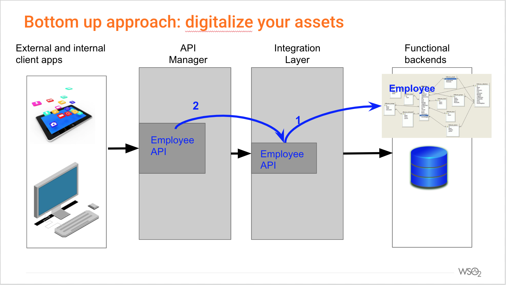

# Demo API first integration
## Intro
The demo aims to cover the 2 possible approaches for API first integration: 1) bottom up and 2) top down
### Bottom up
This case is suitable when a company has a set of digital assets that he wants to make available as managed APIs; it includes 2 steps:
1. The first step transforms the asset (a database table in this sample) in an REST API
2. The second step makes the REST API available to internal and external users as managed API

## Pre requisites
1. Database MySql
2. Salesforce account

## Set up of the env.
### Database
1. Create schema Employees
2. Create a table Employees (using the following script: [(createEmployeesTable.sql)](createEmployeesTable.sql)
3. Add recored to the table (for example using: )

## Description of the demo
### Bottom up

